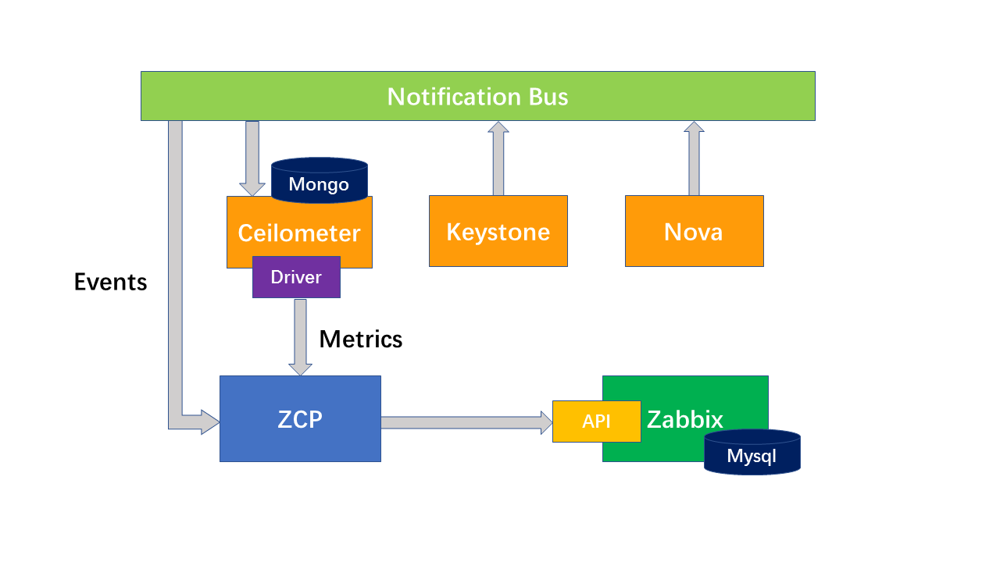

======================
 Project Architecture
======================

ZCP is designed as a timer task for polling ceilometer metrics into zabbix.

Why to design ZCP
------------------

As we all know, Zabbix is a nice open software for monitor the status of hardware.

How ZCP works
-------------

