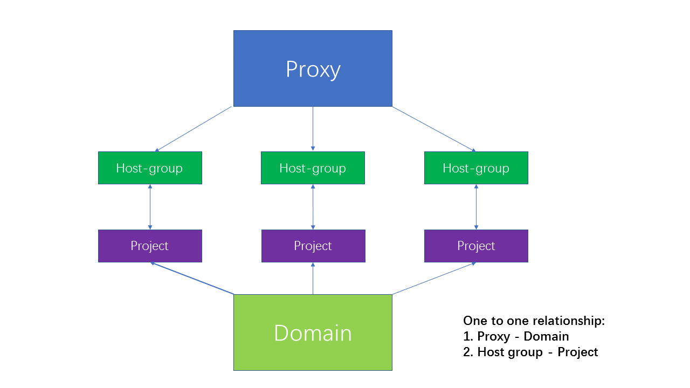

======================
 Project Architecture
======================

ZCP is designed as a timer task for polling ceilometer metrics into zabbix.
It is the abbreviation for Zabbix Ceilometer Proxy.

.. image:: architecture.PNG
   :align: center
   :width: 80%
   :alt: ZCP architecture

Why to integrate Ceilometer with Zabbix
=======================================

As we know, Zabbix_ is an excellent open source monitoring software which
is designed to monitor and track the health status of a network and integrity
of servers. It provides great reporting and data visualisation features based
on the stored data. All statistics, as well as configuration parameters, can
be accessed through web-based frontend. Not only small organisations, but also large
companies can equally use Zabbix to monitor IT infrastructure.

On Ceilometer_ side, it is one of the most important data normalization and
collection services. It allows users to push data to various target and
customize various storage backend.

ZCP was born for the integration between Zabbix and Ceilometer. To be direct,
ZCP system get data from Ceilometer, push data to Zabbix and eventaully display
the data through Zabbix web-based frontend automatically.

.. _Zabbix: https://www.zabbix.com/

Architecture
============

ZCP collect data and then push data to Zabbix server using Zabbix API.

How to gather data?
-------------------

ZCP system offers two ways to gather information automatically:

1. collecting event notifications from `notification Bus`. Now ZCP system only needs
   events from keystone(tenant events) and nova(instance events).
2. using Ceilometer_ RESTFul API to poll metrics periodically.

.. _Ceilometer: https://docs.openstack.org/developer/ceilometer

Main Features
-------------

ZCP implements several significant functions:

1. support keystone v3. One proxy is the mapping of one domains in OpenStack.
   Users can create multiple proxies to meet demands.
2. allow to deploy under the environment of RabbitMQ clusters and gather data
   from multiple rabbitmq servers.
3. automatically gather information(tenants and instances now being considered).
   Seamlessly handle changes in the Cloud Infrastructure including creation
   and deletion of tenants and/or instances.
4. periodically retrieve resources/meters from Ceilometer.
5. provide mongo driver to poll metrics from Ceilometer mongodb directly.

In addition, users just need one common monitoring system(e.g. Zabbix) for several
OpenStack-based Cloud Data Centres.

Mapping relationships
---------------------

1. Proxy-Domain
2. Host group-Project

